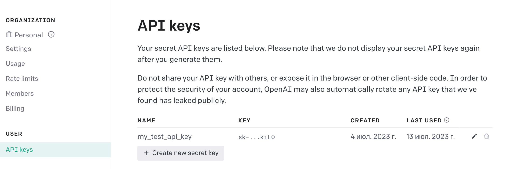
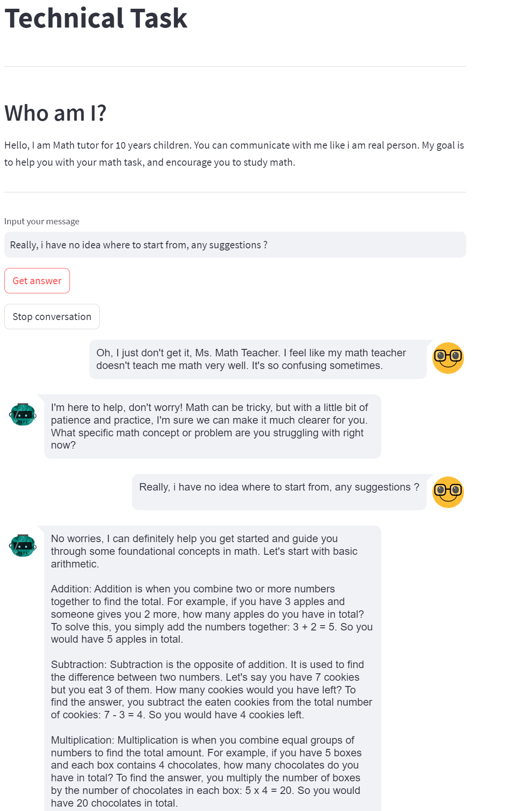
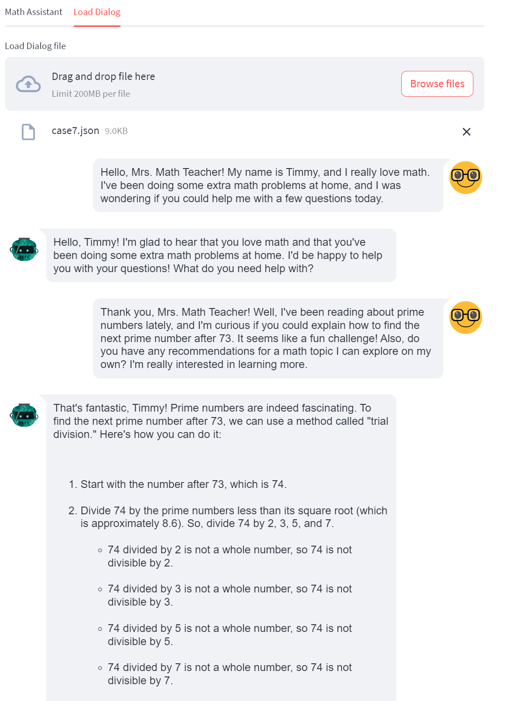

# Math-tutor chat-bot
This project was my technical task for the Prompt Engineer role. 

The goal was to make a chatbot that acts as a Math tutor for 4th-grade students. 

## Technical 
The front-end part was made using the SteamLit library. 

Math-tutor logic was powered with OpenAI API + well-written prompt

I have done PoC using different students' behavior, their personalities you can see in the `prompt-for-eval`
# Setup

## Critical prerequisites to install

* run ```pip3 install -r requirements.txt```

* **Rename the file `.env.example` to `.env`**

* Recommended Python version `3.9` +
---

### How to Generate an OpenAI API key
1. Go to https://platform.openai.com/account/api-keys

2. Click Create a new secret key
   

3. Store the SECRET KEY to `.env` under the `OPENAI_API_KEY`

# GUI 
## Chat yourself


## Load previous dialogs

